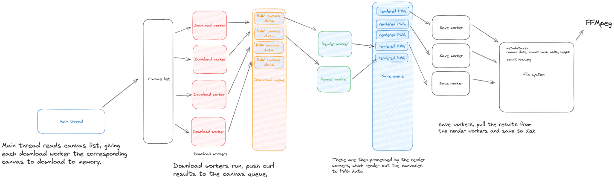

# RplaceTimelapseGenerators
A collection of backup/timelapse generators for the site https://rplace.tk (https://rplace.live).

 - See the rplace server software @[RplaceServer](https://github.com/Zekiah-A/RplaceServer.git) for info on hosting your own rplace instance. 
 - See the main site codebase @[rslashplace2](https://github.com/rslashplace2/rslashplace2.github.io) for helping with rplace development.

### Within this repo there are currently 3 generators.
 - *TimelapseGenerator indicates that the current generator has
the functionality to produce a series of frames, either from server backuplists, or git logs.
 - *BackupGenerator indicates that this generator is only able to produce an image from an rplace canvas backup.

### NodeBackupGenerator
Primitive, slow, naive and easy to run node (javascript-based) generator, which can be found in [NodeBackupGenerator/](NodeBackupGenerator/downloader.js).

### DotnetTimelapseGenerator
Medium performance generator, cabable of generating an animation of the dates from backups, and other edge-case functionality, less configurable (will require source modification), see the dotnet generator at [DotnetTimelapseGenerator/](DotnetTimelapseGenerator/)

### Native timelapse generator
For an extremely highly performant, UNIX compatible, multi threaded generator, see the C, C# hybrid native generator at [NativeTimelapseGenerator/](NativeTimelapseGenerator/).

Dependencies and instructions on how to use each generator can be found within their respective directories.
